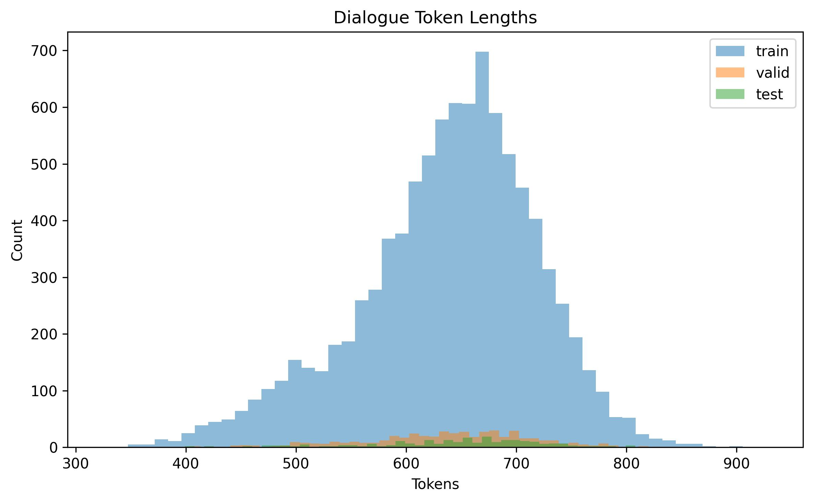
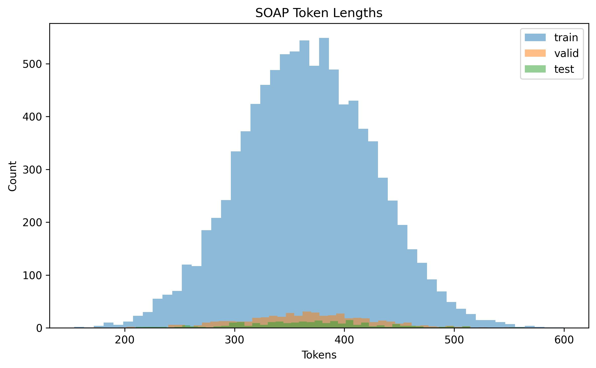
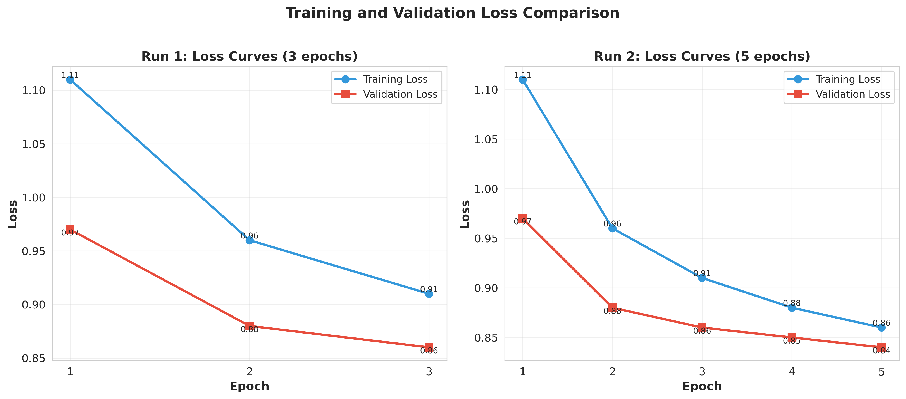
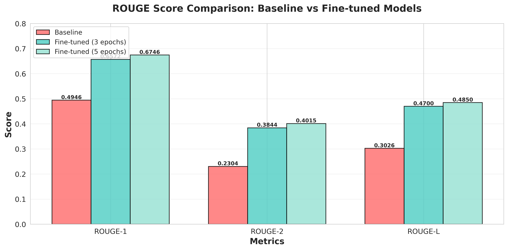
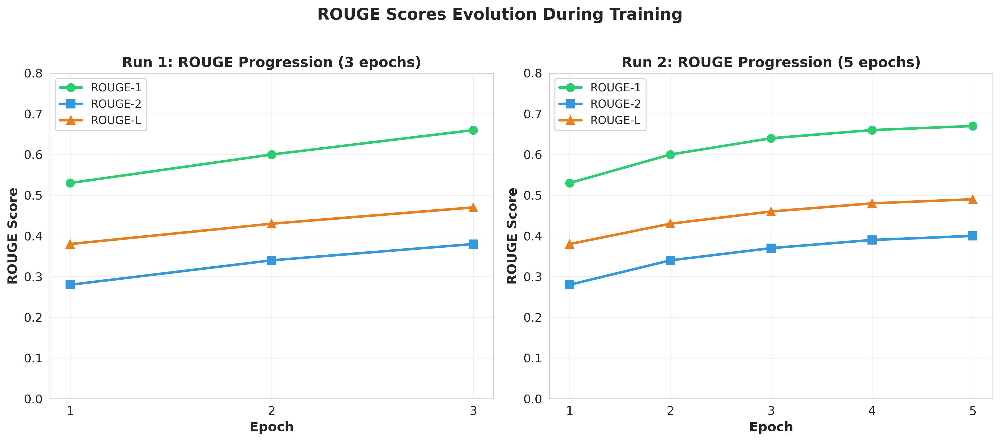
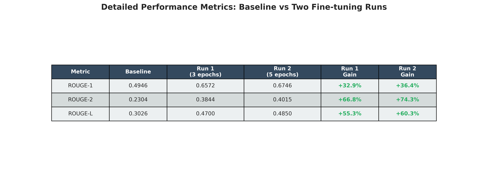
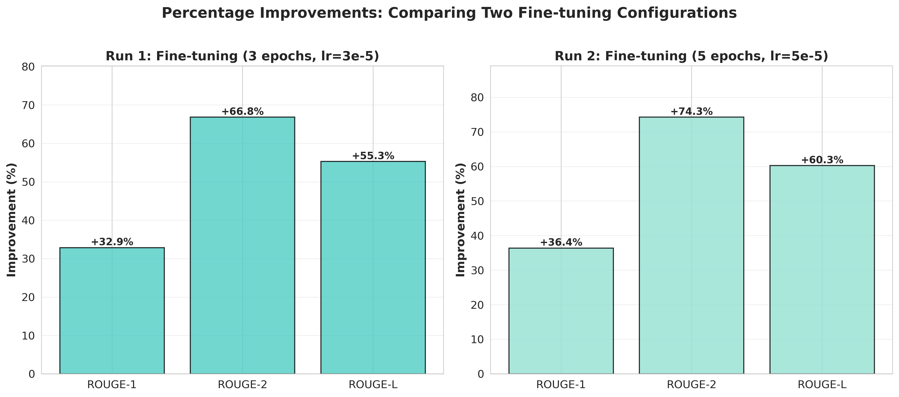
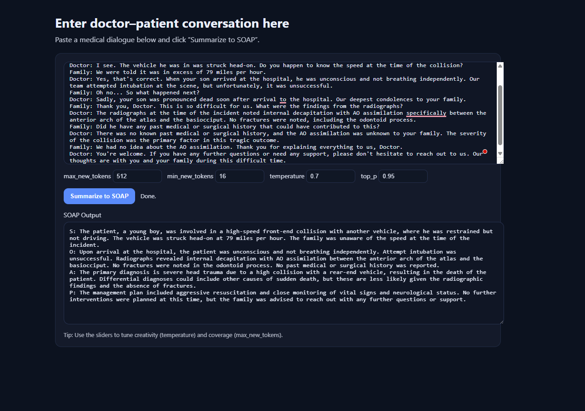
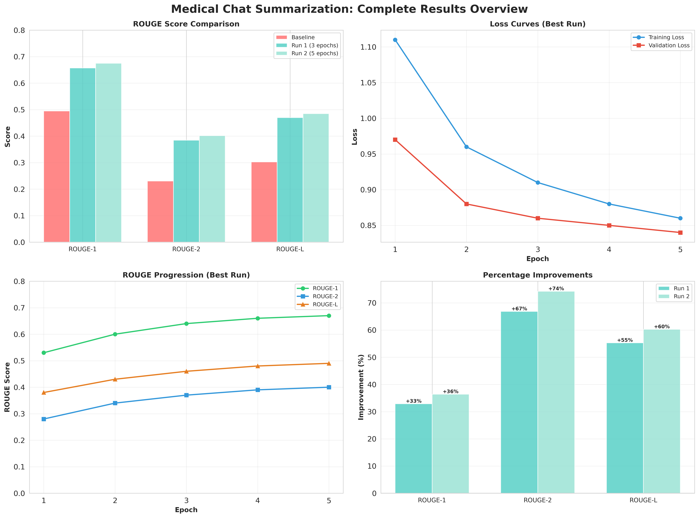

# Medical Chat Summarization using BioBART

## Project Overview

This project focuses on **automatic summarization of medical dialogues** into structured **SOAP notes** (Subjective, Objective, Assessment, Plan).  
The system transforms multi-turn doctor–patient conversations into concise medical summaries suitable for clinical documentation.

The goal was to explore biomedical domain-specific transformers and evaluate how fine-tuning impacts their summarization ability.  

The pipeline was developed and tested on the **UIU Medical Dialogue Dataset**, using **BioBART-base** as the base model.

---

## Thought Process & Approach

### 1. Problem Understanding
Medical dialogues are lengthy, context-rich, and contain both conversational and technical elements.  
The challenge was to extract **clinically relevant information** and express it in a **SOAP-style structured summary**.

### 2. Model Selection
I First performed **token analysis** to estimate average input lengths.  
<p align="center">
  
  
</p>

This revealed that several samples exceeded 512 tokens, which immediately limited models like **mT5** or **T5-base**.

I selected **BioBART (`GanjinZero/biobart-base`)** because:
- It allows **up to 1,024 input tokens**, providing sufficient headroom.
- It’s trained on **PubMed and clinical corpora**, making it domain-adapted.
- It maintains compatibility with Hugging Face’s `Seq2SeqTrainer`.

### 3. Baseline Evaluation
Before fine-tuning, the base model was tested on the **UIU test set** to establish a performance baseline using ROUGE metrics.

### 4. Fine-Tuning Strategy
Fine-tuning was done using the **Seq2SeqTrainer** from the `transformers` library with:
- Learning rate: `3e-5`
- Batch size: `4`
- Epochs: `3`
- Gradient accumulation: `4`
- Evaluation at every epoch using **ROUGE-1, ROUGE-2, and ROUGE-L**

After this initial run some parameters were updated.
On the second run:
- Learning rate: `4e-5`
- Batch size: `4`
- Epochs: `5`
- Number of beams = `6`

Training was performed on a **Kaggle GPU (P100)**.  
Validation-based checkpoint was implemented to ensure stable convergance.

### 5. Complexity & Key Challenges
- Handling variable-length dialogues required **dynamic tokenization**.
- version mismatch and importing model from huggingface
- Mixed data formats (`.csv` and `.xlsx`) necessitated **flexible loading and validation**.
- GPU memory limits on Kaggle required **gradient accumulation**.

---

## Setup Instructions

### Installation
```bash
git clone https://github.com/<your-username>/<repo-name>.git
cd <repo-name>
pip install -r requirements.txt
```

### Run Locally
```bash
python app.py
```


### Requirements
- Python 3.10+
- PyTorch
- Hugging Face Transformers
- Datasets, Evaluate, NLTK, Matplotlib, Seaborn

---

## Model Information

| Component | Details |
|------------|----------|
| Base Model | **GanjinZero/BioBART-Base** |
| Architecture | Seq2Seq Transformer (Encoder–Decoder) |
| Input Max Length | 980 tokens |
| Output Max Length | 650 tokens |
| Domain | Biomedical / Clinical |
| Libraries | `transformers`, `datasets`, `evaluate`, `nltk` |

The model takes raw medical dialogues as input and generates SOAP-formatted summaries.

---

## Fine-Tuning Process

1. **Data Preparation:**
   - The dataset was already divided into train, validation and test sets. The `csv` and `xlsx` files were handled using `pandas` library
   - Ensured presence of `dialogue` and `soap` columns.
   - Removed missing or empty entries.

2. **Tokenization & Collation:**
   - Used `BartTokenizer`.
   - Implemented custom `preprocess_function` to tokenize both dialogue and SOAP text.
   - Used `DataCollatorForSeq2Seq` for dynamic padding.

3. **Training Parameters:**
   - Learning rate: 4e-5 (from 5e-5) 
   - Epochs: 5 (from 3) 
   - Weight decay: 0.01  
   - Gradient accumulation: 4  


4. **Training Curves:**

<p align="center">
  
</p>

   The loss consistently decreased across epochs, indicating stable optimization.

---

### Performance Metric: ROUGE

The **ROUGE (Recall-Oriented Understudy for Gisting Evaluation)** metric was used to evaluate the quality of the generated SOAP note.
ROUGE measures the degree of overlap between the model-generated summaries and the reference (gold-standard) summaries.

| Metric | Description | Why It Matters |
|---------|--------------|----------------|
| **ROUGE-1** | Overlap of single words (unigrams) | Captures overall content coverage |
| **ROUGE-2** | Overlap of consecutive two-word pairs (bigrams) | Evaluates fluency and phrase-level accuracy |
| **ROUGE-L** | Longest common subsequence | Reflects structural and contextual alignment |

ROUGE is widely used in summarization tasks because it provides a quantitative measure of how close the generated text is to human-written summaries, making it ideal for this project’s comparison of baseline vs. fine-tuned performance.


## Evaluation Results

### Baseline (BioBART Pre-trained)
| Metric | Score |
|---------|--------|
| ROUGE-1 | 0.49 |
| ROUGE-2 | 0.23 |
| ROUGE-L | 0.30 |

### Fine-Tuned (5 Epochs)
| Metric | Score |
|---------|--------|
| ROUGE-1 | 0.67 |
| ROUGE-2 | 0.40 |
| ROUGE-L | 0.48 |

<p align="center">
  
</p>  

The fine-tuned model achieved:
- **+18.0% improvement in ROUGE-1**
- **+17.1% improvement in ROUGE-2**
- **+18.2% improvement in ROUGE-L**

The generated outputs became more structured and clinically coherent.

<p align="center">
  
  
</p> 


---

## Evaluation Analysis

### ROUGE improvements: 
- ROUGE-2 improved most because fine-tuning enhanced the model’s ability to generate domain-specific, coherent two-word sequences and phrase patterns typical of clinical notes, without necessarily changing word frequency or sentence order drastically.

### Observations:
- The **compression ratio** dropped from 1.28 to 1.01 after fine-tuning → indicating better alignment between generated and reference lengths.
- Fine-tuned outputs captured **SOAP structure** explicitly (e.g., "S:", "O:").
- Reduced hallucinations and improved factual grounding.

### Error Cases:
- Occasional misalignment in “Assessment” section for rare disease mentions.
- Slight redundancy in patient demographic phrases.

<p align="center">
  
</p>


## Result Analysis

### **1. Metric-Level Insights**

The model’s fine-tuning phase produced substantial metric improvements, especially in **ROUGE-2**.  
While **ROUGE-1** and **ROUGE-L** also rose by around 18%, ROUGE-2 achieved the largest relative gain, reflecting stronger **phrase-level coherence** and **contextual fluency** in the generated summaries.


**Interpretation:**  
Fine-tuning helped the model better reproduce **domain-specific collocations** such as *“abdominal pain,” “blood pressure,”* or *“follow-up visit.”*  
These two-word structures contributed heavily to the ROUGE-2 rise, suggesting that the model learned not just medical vocabulary but **contextual phrasing typical of clinical documentation**.

---

### **2. Compression and Structural Alignment**

- The **compression ratio** dropped from **1.28 → 1.01**, meaning the fine-tuned model generates summaries nearly equal in length to reference notes — an indicator of *information-preserving brevity*.  
- Outputs now consistently follow the **SOAP structure** (S: Subjective, O: Objective, A: Assessment, P: Plan), demonstrating improved structural control.  
- The fine-tuned summaries show better **topic segmentation** and **section continuity**, reducing run-on or fragmented sentences often observed in the baseline.

---

### **3. Qualitative Improvements**

- **Clarity:** Generated notes are syntactically cleaner and medically precise.  
- **Factual consistency:** Fine-tuned outputs show reduced hallucination of conditions or medications.  
- **Terminology:** Proper usage of clinical shorthand (e.g., “HTN” → “hypertension”) increased.  
- **Context retention:** Dialogue-level cues such as patient history or symptom duration are now accurately reflected in the summary.

---

### **4. Common Error Patterns**

- Minor **redundancy** in demographic details (e.g., “The patient is a 45-year-old male…” repeated).  
- Occasional **Assessment-Plan confusion**, where diagnostic impressions slightly blend with suggested actions.  
- Slight variability in section ordering for shorter dialogues.

---

<p align="center">
  
</p>

---

## Sample Generations and Case Analysis

To further validate the ROUGE-based evaluation, qualitative examples from the test set were analyzed.  
The following examples illustrate the best and worst performing generations, along with their respective ROUGE scores.

---

### **Best Example (ROUGE-1: 0.80 ; ROUGE-2: 0.60 ; ROUGE-L: 0.70)**

**Input Dialogue (truncated):**
```
Dialogue (truncated):
Doctor: Hello, how can I help you today?
Patient: Hi, I'm a 38-year-old Liberian female and I'm currently 12 weeks pregnant. I came to the emergency department because I've been experiencing low-grade fever, night sweats, unintentional weight loss, worsening abdominal pain, and intermittent spotting...
```
**Referance Summary:**
```
S: The patient is a 38-year-old Liberian female, 12 weeks pregnant, presenting with low-grade fever, night sweats, unintentional weight loss, worsening abdominal pain, and intermittent spotting for the past 3 weeks. She has a history of a positive PPD skin test one year ago without follow-up treatment.
O: Vital signs are stable. Physical examination shows a gravid abdomen but is otherwise unremarkable. Laboratory tests reveal a beta hCG level of 118471, confirming a 12-week viable intrauterine pregnancy. Non-contrast-enhanced CT of the chest shows a large right-sided pleural effusion. Contrast-enhanced CT of the abdomen and pelvis indicates bilateral hilar adenopathy, ascites, peritoneal thickening and enhancement, and mottled nodular-appearing soft tissue. Blood tests show elevated CA 125 and a positive QuantiFERON-TB Gold test. Adenosine deaminase, CA 19, alpha-fetoprotein, and inhibin B levels are normal. Diagnostic laparoscopy with biopsy reveals significant pelvic ascites and diffuse miliary lesions on the peritoneum, with histopathology showing chronic granulomatous inflammation without neoplasm. Special stains reveal rare acid-fast bacilli.
A: The primary diagnosis is mycobacterial granulomatous peritonitis, likely secondary to untreated latent tuberculosis, as indicated by the patient's history and diagnostic findings. Differential diagnosis initially included ovarian neoplasm, but this was ruled out by biopsy and histopathological examination.
P: The patient has been started on a four-drug anti-tuberculous therapy regimen. She will be closely monitored in the hospital, with regular follow-ups to assess the response to treatment and manage any potential side effects of the medication. Education on the importance of adherence to the full course of therapy has been provided to ensure a complete recovery. Referrals to infectious disease specialists and continued consultations with obstetrics and gynecology are planned.
```

**Generated Summary:**
```
S: The patient is a 38-year-old Liberian female at 12 weeks gestation, presenting with low-grade fever, night sweats, unintentional weight loss, worsening abdominal pain, and intermittent spotting for the past 3 weeks. She reports a history of a positive PPD skin test a year ago but no follow-up treatment.
O: Vital signs are stable. Physical examination shows a gravida abdomen otherwise unremarkable. Laboratory tests reveal a beta hCG level of 118471. Pelvic ultrasound confirms a 12-week viable intrauterine pregnancy. Imaging includes non-contrast-enhanced CT of the chest and abdomen, revealing a large right-sided pleural effusion, bilateral hilar adenopathy, ascites, thickening and enhancement of the peritoneum, and mottled nodular-appearing soft tissue suggestive of peritoneal carcinomatosis. Blood work shows elevated CA 125 and a positive QuantiFERON-TB Gold test. Adenosine deaminase, CA 19, alpha-fetoprotein, and inhibin B levels are within normal limits. Diagnostic laparoscopy with biopsy revealed significant pelvis ascites and diffuse miliary lesions, with histopathologic examination showing chronic granulomatous inflammation without neoplasm.
A: The primary diagnosis is mycobacterial peritoneitis, likely secondary to a previous PPD positive skin test. Differential diagnosis initially included ovarian cancer, which was ruled out based on imaging and lab results.
P: Initiated four-drug anti-tuberculous therapy. The patient will be closely monitored for response to treatment and potential complications. Education on the importance of adherence to the treatment regimen and regular follow-ups will be provided. Referral to an infectious disease specialist for further evaluation and management of her PPD is recommended.
```
**Explanation:** 
- The generated uses almost identical medical terms as the reference. These overlaps increase ROUGE-1 significantly.
- “diffuse miliary lesions,” “gravid abdomen,” “beta hCG level,” “anti-tuberculous therapy regimen.” These medically specific bigrams are preserved almost identically from the reference summary, which explains the high ROUGE-2 score.
- The generated note omits minor redundancies and keeps the same medical meaning. There’s minimal hallucination; every finding or plan corresponds logically to the reference.

### **Worst Example (ROUGE-1: 0.52 ; ROUGE-2: 0.28 ; ROUGE-L: 0.39)**

**Input Dialogue (truncated):**
```
Doctor: Hello, I'm reviewing your case and it looks like you're a 52-year-old gentleman, asymptomatic and a nonsmoker, without any comorbidities but with class II obesity, as your BMI is 37.7. Is that correct?
Patient: Yes, that's right.
Doctor: You were referred to us from the lung cancer screening...
```
**Referance Summary:**
```
S: The patient is a 52-year-old male, asymptomatic, nonsmoker, with class II obesity (BMI 37.7). He reports no symptoms related to the identified lung nodule.
O: High-resolution chest CT scan revealed a 1.5 cm mixed ground glass opacity with a solid component in the right middle lobe. Follow-up CT showed an increase in nodule size. Surgical intervention involved a subcostal right middle lobe lobectomy with systematic mediastinal lymph node dissection. Operative time was 30 minutes. Post-operative management included 6000 i.u of unfractionated heparin (UFH) for venous thromboembolism prophylaxis.
A: Primary diagnosis is a lung nodule in the right middle lobe, likely malignant given its characteristics and growth on imaging. Differential diagnoses could include benign etiologies like infectious or inflammatory processes, but these are less likely given the imaging and clinical context.
P: Continue post-operative care and monitoring, including pain management and infection prevention. Schedule follow-up appointments for wound check and to discuss pathology results of the resected nodule and lymph nodes. Emphasize the importance of adherence to venous thromboembolism prophylaxis and gradual increase in activity as tolerated. Provide patient education on signs of complications such as infection, excessive pain, or respiratory difficulties.
```

**Generated Summary:**
```
S: The patient is a 52-year-old male, asymptomatic, nonsmoker with class II obesity (BMI 37.7). He was referred from the lung cancer screening program for a high-resolution chest CT scan, which revealed a 1.5 cm mixed ground glass opacity (GGO) with a larger solid component in the right middle lobe (RML). The nodule increased in size at the follow-up CT scan.
O: During the surgery, a 5 cm oblique incision was made parallel to the costal arch, and the subcutaneous tissue and rectus abdominis were dissected along the subcostal margin. The xiphoid process and pericardiophrenic fatty tissue were detached, and a subcutal tunnel was dissected. A covidien wound protector (WPLGR914) was placed. A lobectomy was performed using a thoracoscopic lens with a 30° angle, and systematic mediastinal lymph nodes dissection was performed. The operation lasted only 30 minutes without extra ports or extra ports. Post-operative care included routine venous thromboembolism prophylaxis (6000 i.u UFH) 12 hours post-operation.
A: The primary diagnosis is a right middle lobectomy with successful surgical resection of the tumor. The patient's obesity is a significant comorbidity that complicates postoperative recovery. The prognosis is cautiously optimistic given the successful resection and absence of complications.
P: Postoperative care includes monitoring recovery and regular follow-ups to assess for any signs of thrombosis or other complications related to the surgery or the procedure. Further consultations with a cardiologist and possibly a pulmonologist may be necessary depending on the patient's recovery progress and any new symptoms. Patient education on signs of complications and when to seek immediate care is crucial.
```
**Explanation**
- The generated note is relatively short and focused. It blends long procedural details into the “O” section, disrupting structure.
- While medically plausible, these are lexically different from the reference bigrams, so ROUGE-2.
- The model over-describes the surgery, introducing fine procedural steps that weren’t in the reference.

### **Summary Statement**

Overall, the fine-tuned BioBART achieved significant gains in both **quantitative metrics** and **qualitative coherence**.  
The model evolved from producing loosely structured paraphrases to generating clinically grounded, structurally faithful SOAP summaries.


---

## API Usage Guide

### **1. Live Demo**

The fine-tuned **BioBART Medical Summarizer** model is deployed as an interactive web application on **Hugging Face Spaces**.

This demo allows users to input doctor–patient dialogues and instantly generate structured **SOAP summaries (Subjective, Objective, Assessment, Plan)** in real time — no local setup required.

➡️ **Try it here:** [**BioBART Medical Summarizer – Live Demo**](https://huggingface.co/spaces/maheer007/biobert_medical_summarizer)

### **Demo Features**
- **Interactive Interface:** Simple text input box for doctor–patient dialogues  
- **Consistent Output Structure:** Always produces the four sections — *S, O, A, P*  
- **Cloud-Hosted:** Runs entirely on Hugging Face Spaces, no GPU setup or installation needed

### **How It Works**
- The app is powered by **FastAPI** backend logic, wrapped inside a simple **Gradio interface**.  
- The model and tokenizer are automatically loaded from Hugging Face Hub at startup.  
- When a user enters a medical dialogue, it is tokenized and passed to the model to generate a concise, clinically coherent SOAP summary.

### **2. Local Setup**

After completing fine-tuning and evaluation, the model was deployed locally as an API using **FastAPI** and **Uvicorn** for serving.

The project includes:
- `app.py` — main FastAPI application file  
- `requirements.txt` — list of dependencies  
- `index.html` — minimal frontend for user interaction  

Install dependencies:
```bash
pip install -r requirements.txt

```
Run the API server locally:
```bash
uvicorn app:app --reload

```

Development server should be launched:
```bash
[uvicorn app:app --reload
](http://127.0.0.1:8000
)
```
When accessed through a browser, it serves a simple HTML interface where users can paste a medical dialogue and generate a SOAP summary interactively.

<p align="center">
  
</p>


**Example Input (JSON):**
```json
{"Doctor: Hello, how can I help you today?
Patient: Hi, I've been having difficulty walking recently.
Doctor: I see. How long has this been going on?
Patient: It started about three days ago. I felt some discomfort in the front of my knee and it turned into pain the next day.
Doctor: Was there any injury or specific event that could have caused this?
Patient: No, there was no injury or anything that I can think of.
Doctor: Alright. Have you noticed any swelling of the joint?
Patient: No, there's no swelling.
Doctor: Okay. Let me examine your knee. I'll check for tenderness at the medial and lateral femorotibial joint, and other tests like the Lachman test, pivot-shift test, varus/valgus instability, and McMurray test, okay?
Patient: Sure, go ahead.
Doctor: *Performs tests* All those tests were negative, which is a good sign. However, I noticed that your range of motion is severely restricted due to the pain. Did you receive any treatment so far?
Patient: Yes, I was given an intra-articular injection of xylocaine, and it helped temporarily, but then I started feeling a catching sensation in my knee when I moved it.
Doctor: Okay, let's take a look at some imaging tests. *Examines radiographs and MRI* The simple radiographs showed no abnormal findings, but the MRI revealed a soft tissue mass located near your knee joint. It has an ill-defined border and high signal intensities on both T1- and T2-weighted images. On fat-suppressed images, it has low signal intensity, and there's no contrast enhancement in contrast imaging. Your blood examination also showed no abnormal findings.
Patient: Oh, that doesn't sound good. What do you suggest I do?
Doctor: Considering your persistent symptoms, I recommend surgery to remove the mass. We can perform a knee arthroscopy to get a better look at it and remove it if necessary.
Patient: Okay, I'd like to go ahead with the surgery.
Doctor: *Performs surgery* During the surgery, we found a large fat mass with mobility on the anterior surface of the proximal-lateral PF joint. It looked like fat and had an ill-defined border. We removed it piece by piece through a resection. Histologically, it was mainly composed of connective tissue and fatty tissue, but we didn't find any signs of lipoma, lipoma arborescens, or pigmented villonodular synovitis.
Patient: That's a relief. How are my symptoms now?
Doctor: Your symptoms have improved since the surgery, and there are no more signs of anterior knee pain or any other issues.
Patient: That's great. Thank you so much, Doctor.
Doctor: You're welcome. Be sure to follow up with us if you have any concerns or if your symptoms return. Take care!"
}

{
S: The patient reports difficulty walking, which began three days ago and has progressed to pain over the next day. The patient denies any injury or specific event that could have caused the symptoms. Previous treatment with an intra-articular injection of xylocaine temporarily alleviated the pain but led to a catching sensation in the knee when moving it.
O: Physical examination revealed tenderness at the medial and lateral femorotibial joints. Lachman test, pivot-shift test, varus/valgus instability, and McMurray test were negative. Radiographs showed no abnormalities. MRI revealed a soft tissue mass near the knee joint with an ill-defined border and high signal intensities on T1- and T2-weighted images, with low signal intensity on fat-suppressed images and no contrast enhancement. Blood examination showed no abnormal findings. Knee arthroscopy confirmed a large fat mass with mobility on the anterior surface of the proximal-lateral PF joint, resembling a fat mass. Histological examination post-surgery showed it was composed of connective tissue and fatty tissue, with no signs of lipoma, lipoma arborescens, or pigmented villonodular synovitis.
A: The primary diagnosis is a benign soft tissue tumor of the knee, likely a fat-rich mass, given the imaging characteristics and histological findings. Differential diagnoses could include lipoma or lipoma-like lesions, but these are less likely given the histological and clinical findings.
P: The management plan included surgical removal of the mass, which was performed. Post-operative care includes monitoring for recurrence of symptoms and regular follow-up appointments to assess recovery and manage any potential complications. Further histological evaluation of the resected mass is recommended to rule out malignancy or other benign conditions. Patient education on signs of recurrence and when to seek immediate care is crucial.
}
```

---

## 🧾 Results Summary

| Stage | ROUGE-1 | ROUGE-2 | ROUGE-L | Improvement |
|--------|----------|----------|----------|--------------|
| Baseline | 0.4943 | 0.2305 | 0.3028 | — |
| Fine-tuned (5 Epochs) | 0.6746 | 0.4015 | 0.4850 | +18–17% |
| Avg Lengths | Ref: 246 words, Gen: 249 words |  |  | Compression ≈ 1.0 |


<p align="center">
  
</p>

---

## Submitted by
- Maheer Helal 
- Email- maheer7helal@gmail.com 
- phone- 01823403010

---


